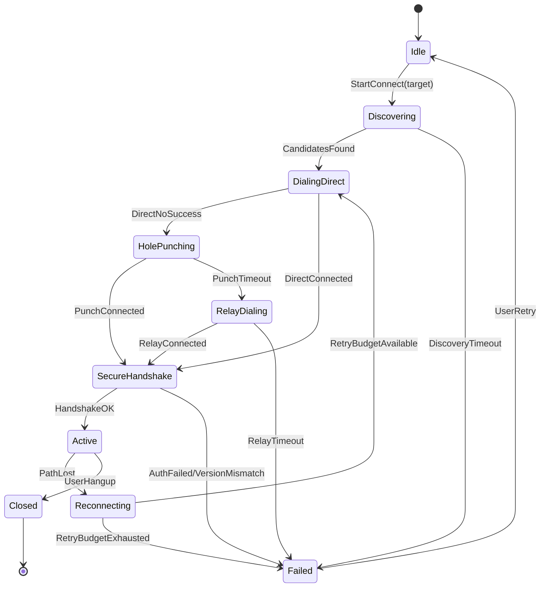

# AetherLink v1 Connection Protocol and State Machine

## 1. Scope

This document defines the v1 control-plane protocol and connection state machine for AetherLink:

- No centralized business server is required.
- End users do not need to deploy infrastructure.
- The network may use community bootstrap and relay peers.
- Direct P2P is preferred; relay is fallback.

Out of scope for this doc:

- UI and product flows.
- OS capture/injection implementation details.
- Codec internals.

## 2. Non-Goals and Physical Constraints

v1 does **not** promise 100% direct connectivity without any third-party reachable node.
When both peers are behind restrictive NAT/firewall, at least a reachable helper is needed for:

- introduction/bootstrap, and/or
- relay forwarding.

## 3. Terminology

- `PeerId`: libp2p peer identity derived from Ed25519 public key.
- `Controller`: device initiating remote control.
- `Target`: device being controlled.
- `Bootstrap Peer`: long-lived public peer for joining DHT.
- `Relay Peer`: libp2p relay v2 peer used when direct path fails.
- `Candidate`: reachable address or relay route that may form a session path.

## 4. Architecture Summary

1. Identity: each device owns an Ed25519 keypair.
2. Discovery:
- LAN: mDNS.
- WAN: Kademlia DHT.
3. Connectivity attempts:
- direct IPv6/direct observed address,
- NAT traversal (DCUtR + UDP hole punching),
- relay fallback.
4. Session security:
- app-layer authenticated handshake on top of transport.
- replay protection via nonce + timestamp window.

## 5. Transport and Channel Layout

Base transport: QUIC (`libp2p-quic`).

Channel policy:

- `Control Stream` (reliable, ordered): session handshake, candidates, config, stats.
- `Input Stream` (reliable, ordered): keyboard/mouse/touch events.
- `Video Datagram` (unordered, lossy): encoded video chunks (NALU fragments).
- `Audio Stream` (optional, v1.1): reliable or partially reliable, not required for v1.

Rule:

- Never multiplex heavy video payload onto the same stream used for control messages.

## 6. Identity and Trust Model

Each device persists:

- `device_private_key` (Ed25519).
- `peer_id`.
- `device_code` (human-shareable Base32 of peer fingerprint).

Pairing model:

- First contact requires out-of-band verification (fingerprint or short code).
- Once trusted, store remote pubkey fingerprint and trust level.
- Any key change on known `device_code` is treated as suspicious and requires re-approval.

## 7. Discovery and Connection Algorithm

## 7.1 Candidate Sources

Collect candidates in this order (all can run in parallel):

1. local cache (last good path).
2. mDNS (same LAN only).
3. DHT provider record lookup by target `PeerId`.
4. relay advertisements from DHT/known peers.

Candidate freshness:

- TTL default: 120s.
- stale candidates can be tried with lower priority.

## 7.2 Dial Race Strategy

Perform staged parallel dialing:

1. `t=0ms`: try direct IPv6/direct public candidates.
2. `t=200ms`: start DCUtR/hole punching attempts.
3. `t=1600ms`: start relay dial if no secure session yet.

Winner policy:

- first connection that completes authenticated handshake becomes active.
- all other pending paths are canceled.

## 8. State Machine

## 8.1 State Definitions

- `Idle`: no active session.
- `Discovering`: candidate resolution from DHT/mDNS/cache.
- `DialingDirect`: direct path attempts.
- `HolePunching`: coordinated NAT traversal attempts.
- `RelayDialing`: relay fallback attempts.
- `SecureHandshake`: app-level session auth/negotiation.
- `Active`: media + input streams running.
- `Reconnecting`: path recovery while session token remains valid.
- `Failed`: terminal failure for current attempt.
- `Closed`: normal close.

## 8.2 Timer and Retry Defaults (v1)

- discovery timeout: `2500ms`.
- direct dial budget: `1500ms`.
- punch budget: `2200ms`.
- relay dial timeout: `2500ms`.
- handshake timeout: `1200ms`.
- ping interval: `1000ms`.
- path-lost threshold: `3` consecutive ping misses.
- reconnect budget: `15s` total, exponential backoff `200ms -> 2s`.

## 9. Control Protocol (Protobuf)

Canonical file: `proto/aetherlink/v1/control.proto`.

Principles:

- all control messages are wrapped in `ControlEnvelope`.
- every request has `request_id` for idempotency.
- protocol version included during session open.

Core message groups:

1. Session: `SessionRequest`, `SessionAccept`, `SessionReject`, `SessionClose`.
2. Path setup: `CandidateAnnouncement`, `PunchSync`.
3. Pairing and permissions: `PairingChallenge`, `PairingConfirm`, `PermissionGrant`, `PermissionRevoke`.
4. Keepalive: `Ping`, `Pong`.
5. Runtime config: `VideoConfigUpdate`.
6. Input events: `InputEvent`.
7. File transfer: `FileOffer`, `FileChunk`, `FileAck`, `FileCancel`.
8. Clipboard and recording: `ClipboardFrame`, `RecordingStart`, `RecordingStop`, `RecordingStatus`.
9. Telemetry and errors: `StatsReport`, `ErrorFrame`, `PathDecision`, `QualityReport`.

## 10. Security Rules (Mandatory)

1. Session request must include:
- random nonce (>= 96 bits entropy),
- sender timestamp (unix ms),
- signature over canonical payload.
2. Session accept must include:
- responder identity,
- response nonce + timestamp,
- responder signature over canonical payload,
- echoed `request_nonce` binding to the originating request.
3. Receiver verifies:
- timestamp within allowed window (`+-30s`),
- nonce not seen before in replay cache (`60s` retention),
- signature and trusted key policy.
4. Session keys:
- derived during transport/auth handshake.
- rotate on reconnect or every 10 minutes.
5. Relay confidentiality:
- payload remains end-to-end encrypted at app layer.

## 11. Video Data Plane Rules

v1 video packetization requirements:

- packet type carries `frame_id`, `chunk_id`, `chunk_count`, `pts_us`.
- keyframe marker required.
- drop late non-key chunks when jitter budget exceeded.
- decoder requests IDR refresh when loss bursts exceed threshold.

Initial operating profile (PoC):

- codec: H.264 baseline.
- resolution: up to 1280x720.
- framerate: 30 fps target.
- adaptive bitrate: start 2.5 Mbps, floor 0.6 Mbps, ceiling 8 Mbps.

## 12. Compatibility and Versioning

- `ProtocolVersion.major` mismatch: reject.
- `minor` mismatch: allow if required fields exist.
- unknown fields must be ignored.
- new message types must be optional and feature-gated.

## 13. Observability (Required Metrics)

Expose per-session metrics:

- `rtt_ms` (p50/p95),
- packet loss rate,
- effective bitrate (tx/rx),
- frame encode/decode latency,
- relay/direct path flag,
- reconnect count and reason code.

## 14. Minimal Implementation Order

1. Implement control.proto serialization and envelope router.
2. Build state machine skeleton with timers and transitions.
3. Implement discovery providers (cache, mDNS, DHT).
4. Implement dial race (direct -> punch -> relay).
5. Implement secure session handshake checks (nonce/timestamp/signature).
6. Wire metrics and structured logs before media optimization.
